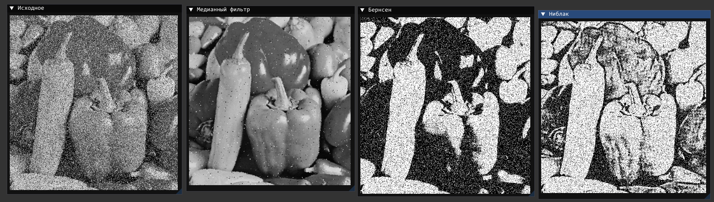
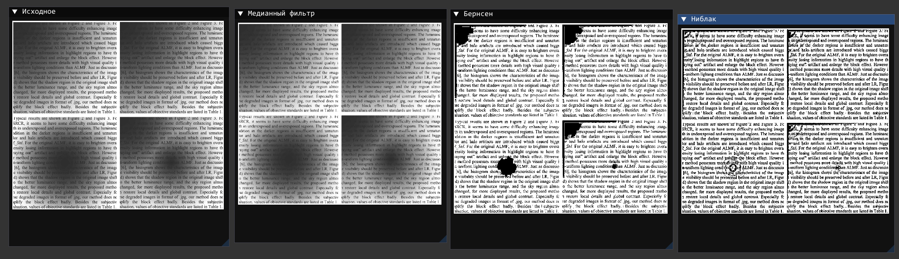
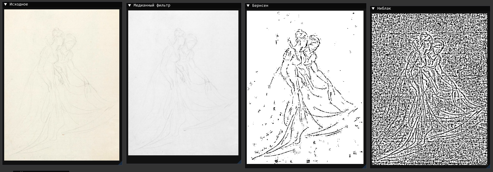

# Отчет по 2 лабораторной работе

Вариант: 15

### Задача
реализовать:

1.  Нелинейная фильтрация: Реализация фильтров, основанных на порядковых статистиках. (Выбран: Медианный фильтр).
2.  Локальная пороговая обработка: Реализация двух методов на выбор. (Выбраны: Метод Бернсена и Метод Ниблака).

### Использованные библиотеки
Проект реализован на языке C++ с использованием следующих библиотек:

*   Графический интерфейс: [Dear ImGui](https://github.com/ocornut/imgui) (+ OpenGL 3.0 + GLFW.)
*   Загрузка изображений: [stb_image](https://github.com/nothings/stb/tree/master)

---

### Результаты

#### 1: Шум
![[noise.jpg]]

*   Медианный фильтр: Лучший результат. Удалил белые и черные точки, сохранил границы объектов. Изображение стало чистым
*   Бернсен/Ниблак: Эти методы предназначены не для удаления шума

#### 2: Текст с тенью

![[shadow.jpg]]

*   Медианный фильтр: слегка размыл текст
*   Метод Бернсена: где контраст низкий он неверно залил область черным цветом
*   Метод Ниблака: Лучший результат. Текст выделен даже в самой темной тени.

#### 3: Бледный рисунок
![[faint.jpg]]

*   Медианный фильтр: Ничего в целом не изменил
*   Метод Бернсена: Лучшие результат. Границы рисунка стали четко видны. Нет шумного фона
*   Метод Ниблака: Из-за малой контрастности ошибочно принял фон за границы рисунка

### Вывод
В ходе работы были реализованы и протестированы различные подходы к обработке изображений:

1.  Медианный фильтр хорошо справляется с удалением шума типа
2.  Метод Бернсена хорошо справляется с бледными изображениями
3.  Метод Ниблака хорошо справляется с тенями